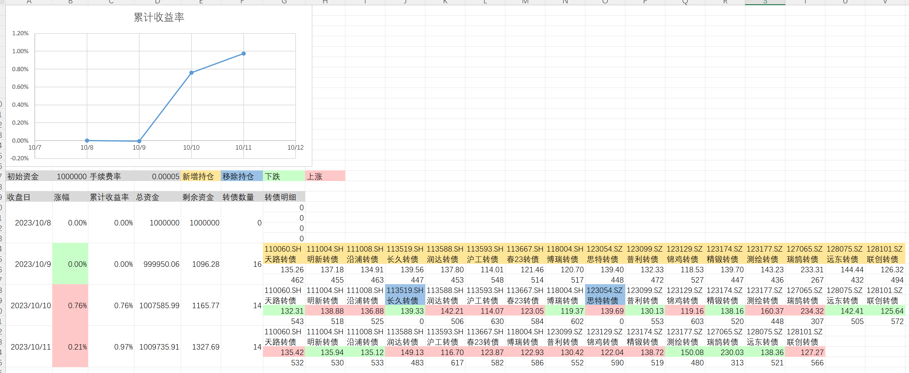

# trending-stock

强势正股-可转债策略回测脚本

### 环境依赖

- [python-3.8.10](https://www.python.org/downloads/release/python-3810/)
- [Choice 数据量化接口](https://quantapi.eastmoney.com/Download?from=web)
- [xlwings](https://docs.xlwings.org/zh_CN/latest/quickstart.html)

### 使用方法

- 将 `./doc` 中的表格文件复制到当前目录中。
- 根据需求修改表格中的基础数据（转债代码、初始资金、手续费、日期等）。
- 可转债表格可每日更新一次，运行脚本后可导出当前收益率信息至 “收益率.xlsx” 表格中。